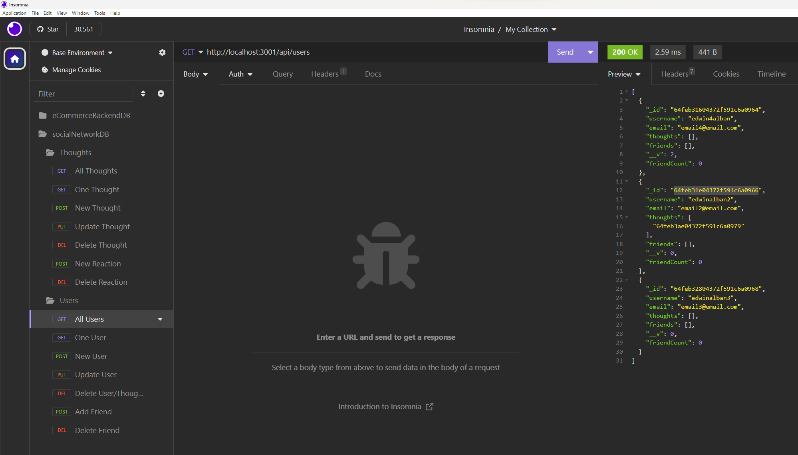

# Social-Network-API-NoSQL
API for a social network using MongoDB, Mongoose, and Express

Creates a database for allowing Users to connect by posting their thoughts and reactions with regard to information, and manages their freinds lists.

## Description

I built this project in order to practice using NoSQL databases and queries to view, add, and edit/delete information. I learned about MongoDB/Mongoose queries, the use of controllers to create endpoints for routes, the difference between a Model and a Schema, documents and subdocuments in MongoDB.

## Table of Contents

- [Installation](#installation)
- [Usage](#usage)
- [Tests](#tests)

## Installation

You will need to install Node.js, Express.js, MongoDB, and Mongoose in order to use this app. You will also need to download Insomnia, or Postman in order to test the routes for functionality.

Instructions for installating Node.js can be found here: https://coding-boot-camp.github.io/full-stack/nodejs/how-to-install-nodejs 

Express.js can be installed by typing "npm install express" into the terminal command line.

Instructions for installing MongoDB can be found here: https://www.mongodb.com/docs/manual/installation/

Mongoose can be installed by typing "npm install mongoose" into the terminal command line.

## Usage

In order to use the application, all you will need to do is type "npm run start" into your terminal and utilize Insomnia to find, add, update, or remove data in MongoDB.

A link to the video to showcase the functionality of the app is below.

https://drive.google.com/file/d/1WOEAbrlNSCSTbapT9__89-XtcoYo4zdY/view

## Tests

This project can be tested by adding users, friends, thoughts, and reactions via Insomnia. You will then be able to update and delete data to modify the information stored in MongoDB.